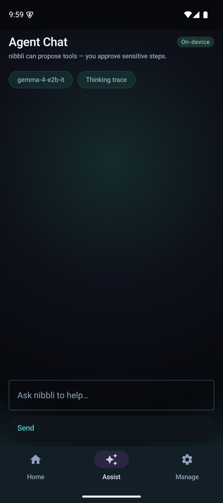
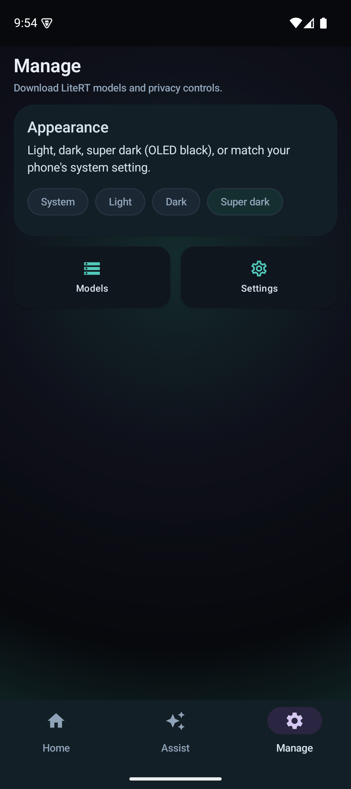

# nibbliGO

A local-first Android companion: an evolving **pixel friend** on Home, plus on-device **Assist** (chat, agent tools, prompt lab). Inference runs on your phone with LiteRT — no cloud model calls.

**Privacy:** LiteRT inference on device. Network is used only for Hugging Face model downloads (and optional OAuth), not for sending your chats to a cloud LLM.

## Screenshots

| Home (super dark) | Agent Chat | Manage |
|:---:|:---:|:---:|
|  |  |  |

Regenerate after UI changes:

```bash
./scripts/capture-readme-screenshots.sh   # requires adb + running emulator/device
```

## Features

### Home — Pixel Friend

- Tamagotchi-style **P1 LCD** pet with care actions (feed, play, clean, medicine, sleep).
- **Talk** sheet and quick chips; **Talk to me** sends voice to **Agent Chat**.
- **Looks** — unlock cosmetic overlays (collar, star patch, aurora aura) and equip them on the sprite.
- On-device **mood lines** about once per minute while Home is visible, the app is in the foreground, and nibbli is awake (requires an installed LiteRT model).
- **Catch** minigame, diary export, home-screen **widget**.

### Assist

- **Local Chat** — streaming chat with a downloaded LiteRT model.
- **Agent Chat** — tool-calling agent with **confirm before run** for sensitive actions.
- **Prompt Lab** — prompt playground on device.

### Manage

- **Models** — download LiteRT weights from Hugging Face (`functiongemma-270m`, `gemma-4-e2b-it`, …).
- **Appearance** — Light, Dark, **Super dark** (OLED-friendly midnight), or System.
- **Settings** — privacy, storage, HF token, **pixel friend personality** (Playful / Calm / Curious).

### Phone tools (Agent Chat, after confirm)

Opens system apps via [`MobileActionsPerformer`](core/mobile-actions/src/main/kotlin/com/nibbli/nibbligo/core/mobileactions/MobileActionsPerformer.kt): flashlight, create contact, **email draft** (`ACTION_SENDTO`), maps, Wi‑Fi settings, calendar event.

### Navigation

Bottom tabs: **Home**, **Assist**, **Manage**. Sense and Do hubs exist in the nav graph but are hidden from the bottom bar in this build.

## Requirements

- Android Studio Ladybug or newer
- JDK 17
- Android SDK 35
- Device or emulator **API 31+** (Android 12+)

## Quick start

```bash
./gradlew :app:assembleDebug
./gradlew :app:installDebug
adb shell am start -n com.nibbli.nibbligo/.MainActivity
```

1. **Manage → Models** — download `functiongemma-270m` (~289 MB) for fast emulator testing, or `gemma-4-e2b-it` (~2.6 GB) for richer chat.
2. **Home** — care for nibbli; install a model for Talk and mood lines.
3. **Assist → Agent Chat** — e.g. “send an email to me about lunch”, then confirm the tool.

### Emulator (Pixel 9a profile)

```bash
./scripts/run-pixel9a-emulator.sh
```

Or manually:

```bash
export ANDROID_HOME=$HOME/Android/Sdk
export PATH=$ANDROID_HOME/platform-tools:$ANDROID_HOME/emulator:$PATH
emulator -avd Pixel_9a_API_35 -no-snapshot-load -memory 4096 &
adb wait-for-device
./gradlew :app:installDebug
```

## Demo flow

1. **Manage → Models** — install `functiongemma-270m`.
2. **Manage → Appearance** — try **Super dark**.
3. **Home** — feed/play; open **Talk** or use quick chips; try **Talk to me** (mic → Assist).
4. **Assist → Agent Chat** — ask for an email or flashlight; confirm the tool card.
5. Unlock **Looks** by raising trust/skill, then equip a cosmetic on the LCD pet.

## Pixel Friend (simulation + LLM)

| Piece | Role |
|--------|------|
| [`PetSimulationEngine`](feature/pet/src/main/kotlin/com/nibbli/nibbligo/feature/pet/domain/PetSimulationEngine.kt) | Hunger, hygiene, energy, sickness, evolution, death → new egg |
| [`PetTickWorker`](feature/pet/src/main/kotlin/com/nibbli/nibbligo/feature/pet/work/PetTickWorker.kt) | Background decay (~15 min); notifications when needs stay critical |
| [`core:pet-llm`](core/pet-llm/) | LiteRT reactions for Talk and mood pulse |
| Status questions (“How are you?”) | Fast honest reply from stats (no LLM) |
| Other talk / mood pulse | Full on-device generation when a model is installed |

Care works without a model; **Talk** and LLM mood lines need a downloaded `.litertlm` file.

## Agent & tools

- [`AgentOrchestrator`](core/agent/src/main/kotlin/com/nibbli/nibbligo/core/agent/AgentOrchestrator.kt) — multi-step turns, confirmation for `SENSITIVE` tools.
- [`PhoneActionAgentTools`](core/agent/src/main/kotlin/com/nibbli/nibbligo/core/agent/tools/PhoneActionAgentTools.kt) — Gallery-style phone actions for FunctionGemma.
- **SKILL.md** packages under `assets/skills/`; bundled `nibbli_tasks`, `nibbli_clipboard`.
- **MCP** — StreamableHTTP tools (see Settings / actions flows); discovered tools appear in Agent Chat with confirmation.

## Module map

```
app/                  Shell, navigation, Hilt
core/model/           Domain types (pet, agent, theme)
core/designsystem/    Theme (incl. super dark), shared Compose UI
core/ui/              Loading / empty / error
core/domain/          Repositories, PetEventBus
core/storage/         Room, DataStore
core/runtime/         InferenceRuntime interface
core/runtime-litert/  LiteRT-LM (chat, agent, tools)
core/litert-engine/   Engine pool (Gallery-derived)
core/pet-llm/         Pet reaction LLM
core/agent/           Orchestrator, tool registry, skills bridge
core/mobile-actions/  Intents: email, maps, flashlight, …
core/hf-download/     Hugging Face OAuth + downloads
core/mcp/             MCP tool discovery
feature/pet/          Home, pixel UI, widget
feature/agent/        Agent Chat UI
feature/chat/         Local chat
feature/promptlab/    Prompt Lab
feature/image/        Ask Image
feature/audio/        Audio Scribe
feature/actions/      Safe actions UI (Do route)
feature/models/       Model browser
feature/benchmark/    Benchmarks
feature/settings/     Settings screen
```

## On-device runtime

Models live under app storage as `*.litertlm`. Chat, Agent, Prompt Lab, and pet LLM features prompt you to download from **Manage → Models** first.

Vision, audio, and benchmarks may be limited depending on the installed model and build.

## Tests

```bash
./gradlew test
./gradlew connectedAndroidTest   # device/emulator required
```

Unit tests cover `PetSimulationEngine`, `ModelCatalog`, `SkillManifestParser`, `AgentOrchestrator`, phone `ToolExecutor`, and sprite/cosmetic helpers. Some instrumented flows need a downloaded model and are `@Ignore` by default.

## Google AI Edge Gallery

nibbliGO ports patterns from [Google AI Edge Gallery](https://github.com/google-ai-edge/gallery) (Apache 2.0). See [NOTICE](NOTICE).

| Module | Role |
|--------|------|
| `core:litert-engine` | LiteRT `Engine` / `Conversation` |
| `core:hf-download` | Hugging Face OAuth + token storage |
| `core:agent` | `GallerySkillWebViewBridge` |

### Hugging Face OAuth (model downloads)

1. Create a [Hugging Face OAuth app](https://huggingface.co/settings/applications).
2. Add to `local.properties`:

   ```
   hf.oauth.clientId=your_client_id
   hf.oauth.redirectUri=nibbli://oauth/huggingface
   ```

3. Download models under **Manage → Models**. Public `litert-community` weights often work without sign-in.

   **Gated models:** **Settings** → paste a [HF access token](https://huggingface.co/settings/tokens), or use OAuth after step 2.

Redirect: `nibbli://oauth/huggingface` in [`MainActivity`](app/src/main/kotlin/com/nibbli/nibbligo/MainActivity.kt). Allowlist aligned with [Gallery 1.0.15](https://github.com/google-ai-edge/gallery/blob/main/model_allowlists/1_0_15.json).

### MCP servers

Configure StreamableHTTP MCP in the actions/settings flows (see [Gallery MCP guide](https://github.com/google-ai-edge/gallery/blob/main/mcp/README.md)). Tools show up in Agent Chat with confirmation.

### Gallery submodule (reference)

```bash
git submodule update --init third_party/gallery
```

## Roadmap

- CameraX / gallery picker for Ask Image
- Download progress and resume for large LiteRT models
- Re-enable Sense / Do bottom tabs when those hubs are product-ready
