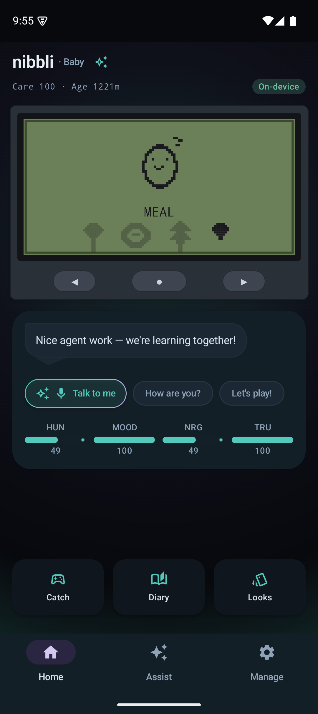
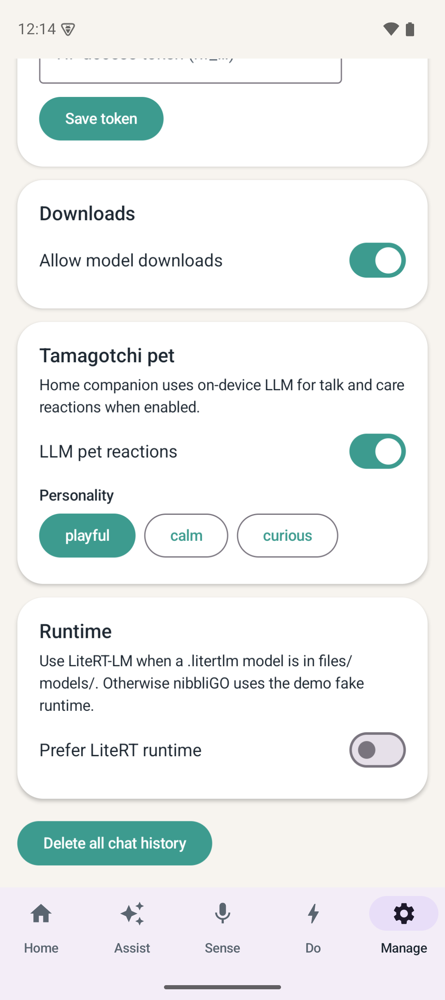
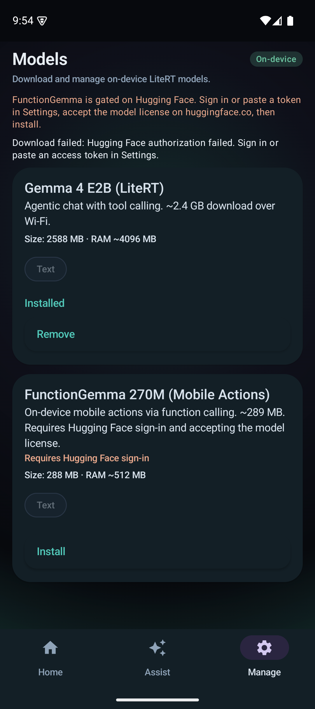

# nibbliGO

A local-first Android companion: an evolving **Pixel Friend** on Home, plus on-device **Assist** (chat, agent tools, prompt lab). Inference runs on your phone with LiteRT — no cloud model calls.

**Privacy:** LiteRT inference on device. Network is used only for Hugging Face model downloads (and optional OAuth), not for sending your chats to a cloud LLM.

## Screenshots

| Home (super dark) | Pixel Friend talk | Manage → Models |
|:---:|:---:|:---:|
|  |  |  |

Regenerate after UI changes:

```bash
./scripts/capture-readme-screenshots.sh   # requires adb + running emulator/device
```

## Features

### Home — Pixel Friend

- Retro **P1 LCD** pet with care actions (feed, play, clean, medicine, sleep).
- **Talk** sheet plus Home quick actions: **Talk to me** (voice → home talk), **How are you?**, and **Stop** (cancels an in-flight reply).
- In **talk mode**, the pet moves to the bottom-left of the LCD and the LLM reply is centered on-screen (scrolls when long); conversation history appears below the stat strip in the companion panel.
- A **chat bar** at the bottom of Home lets you type messages to nibbli anytime (inline send icon, same on-device Pixel Friend model as the quick chips). The bar stays pinned above the quick-action strip; the window resizes with the keyboard (bottom tabs stay visible).
- **Talk to me** (mic) sends your voice transcript into **home talk** — same Pixel Friend session as the text bar and Chat tab.
- Typed Home talk and the **Chat** tab share one **Pixel Friend (Home)** thread (user + assistant lines only).
- After talk, nibbli may **propose a memory** (“Remember this?”) — you approve before it is saved to **Manage → Companion**.
- **LCD Items** — all customization lives on the P1 shell: care menu → **Items** → ◀ exit · ▶ browse · ● equip. Cycle **wearables** (collar, star patch, aurora aura), **scenes** (cozy, stars, clouds, night), and **floor props** (ball, plant, mat) with live preview on the LCD. Unlocks via care score, evolution, arcade wins, and daily quest bonus.
- **Arcade** — retro **Snack Drop** and **Tidy Tap** minigames (Home → Play); wins unlock floor props.
- **Visit** — scan a friend’s visit QR to show their nibbli on your LCD for 24h (local-only, no server). Postcards include an optional message, a **care tip**, and a **borrowed prop/scene** souvenir on your nibbli. Local visit streak tracked on device.
- **Share** — export PNG cards (today, evolution, quote, minigame score).
- Optional **mood pulse** — spontaneous LLM lines while Home is visible, the app is in the foreground, and nibbli is awake (**Manage → Companion → Behavior**: off / normal / quiet).
- Diary export and home-screen **widget**.
- Pet engine **warm-loads** when you open Home so the first chip reply is faster.
- Post-onboarding **model setup** banner prompts download of the recommended Pixel Friend model (collapsible; tap **Later** to tuck it away).
- Home header badge shows the active **Pixel Friend model** and, after warm load, the LiteRT backend in use (**GPU**, **CPU**, or **NPU**).
- **P1 LCD** uses a unified card shell in light/dark themes; LCD pixels (sprites, text, props, scenes) render in fixed dark ink on the green screen.

### Chat — Pixel Friend

- **Chat** tab is your Pixel Friend only — same conversation as Home talk, on-device, no separate Assist thread.
- Card-style message bubbles (no speech tails); streaming replies with a keyboard-aware composer.
- Link to **Agent Chat** for email/calendar tasks.

### Assist (Manage hub)

- **Agent Chat** — tool-calling agent with **confirm before run** for sensitive actions (email, calendar, etc.). Uses companion profile + memory as local context on the first turn.
- **Prompt Lab** — prompt playground on device (A/B one message, see exact system prompts).
- **Benchmark** — compare TTFT and tokens/sec on your phone with plain-language tips.

### Manage

- **Models** — download LiteRT weights from Hugging Face (see [Model catalog](#model-catalog) below).
- **Companion** — profile, memory, **Pixel Friend talk model**, personality, comment-on-chat, mood pulse.
- **Learn edge AI** — Benchmark, Prompt Lab, and Agent shortcuts with short on-device AI literacy copy.
- **Settings** — appearance (theme + **accent color**), privacy, storage, HF token, default app model, LiteRT accelerator, delete chat history.

**Appearance** (in Settings): Light, Dark, **Super dark** (OLED-friendly), or System; five accent palettes — **Teal**, **Lavender**, **Sage**, **Dusk**, **Sand**.

### Phone tools (Agent Chat, after confirm)

Opens system apps via [`MobileActionsPerformer`](core/mobile-actions/src/main/kotlin/com/nibbli/nibbligo/core/mobileactions/MobileActionsPerformer.kt): flashlight, create contact, **email draft** (`ACTION_SENDTO`), maps, Wi‑Fi settings, calendar event.

### Navigation

Bottom tabs: **Home**, **Chat**, **Manage** (tabs stay visible while typing). Agent, Benchmark, and Prompt Lab live under **Manage → Learn edge AI**. Sense and Do hubs exist in the nav graph but are hidden from the bottom bar in this build.

## Model catalog

| Model | Size (approx.) | Best for | HF sign-in |
|--------|----------------|----------|------------|
| **Qwen 2.5 1.5B Instruct** | ~1.6 GB | **Pixel Friend** (recommended), general chat | No |
| **SmolLM2 360M Instruct** | ~374 MB | Fast dev / emulator, no-login | No |
| **FunctionGemma 270M** | ~289 MB | **Agent** mobile actions (CPU) | Yes |
| **Gemma 3 1B IT** | ~584 MB | Pixel Friend / chat (quality) | Yes |
| **Gemma 4 E2B** | ~2.4 GB | Rich chat, thinking trace | No |
| **DeepSeek R1 Distill 1.5B** | ~1.8 GB | Reasoning-style chat | No |

**Recommended paths**

- **Home talk (recommended):** install **Qwen 2.5 1.5B Instruct** after onboarding (~1.6 GB, no HF login); or **SmolLM2 360M** for fast emulator testing.
- **Agent email/calendar:** install **FunctionGemma 270M** (gated; accept license + HF token in Settings).
- **Chat tab:** uses the same Pixel Friend model as Home (**Manage → Companion → Talk model**).

## Requirements

- Android Studio Ladybug or newer
- JDK 17
- Android SDK 35
- Device or emulator **API 31+** (Android 12+)

## Quick start

```bash
./gradlew :app:assembleDebug
./gradlew :app:installDebug
adb shell am start -n com.nibbli.nibbligo/.MainActivity
```

1. Complete **onboarding** (5 steps) on first launch.
2. **Manage → Models** — download **Qwen 2.5 1.5B Instruct** for Home talk (or **SmolLM2 360M** on emulator).
3. **Home** — wait a few seconds for warm load; check the model badge (e.g. `SmolLM2 360M Instruct · CPU` on emulator); tap **How are you?** or type in the chat bar.
4. **Manage → Learn edge AI → Agent** — install **FunctionGemma 270M** for tool calls; ask e.g. “draft an email about lunch”, then confirm.

### Emulator (Pixel 9a profile)

```bash
./scripts/run-pixel9a-emulator.sh
```

Or manually:

```bash
export ANDROID_HOME=$HOME/Android/Sdk
export PATH=$ANDROID_HOME/platform-tools:$ANDROID_HOME/emulator:$PATH
emulator -avd Pixel_9a_API_35 -no-snapshot-load -memory 4096 &
adb wait-for-device
./gradlew :app:installDebug
```

**Emulator note:** LiteRT usually runs on **CPU** on AVDs. Settings → **LiteRT accelerator → Auto** skips GPU probing on emulators. On a physical Pixel, Auto tries **GPU (OpenCL)** first — the app declares vendor libs (`libOpenCL.so`, `libOpenCL-pixel.so`, etc.) in `AndroidManifest.xml` like [Edge Gallery](https://github.com/google-ai-edge/gallery). Run **Manage → Benchmark → Pet paths** and check the backend line (`Device (GPU)` vs `Device (CPU)`).

Fresh onboarding test: `adb shell pm clear com.nibbli.nibbligo` then relaunch.

## Demo flow

1. **Manage → Models** — install **Qwen 2.5 1.5B Instruct** (or SmolLM2 on emulator).
2. **Manage → Settings → Appearance** — try **Super dark** and accent swatches (Teal, Lavender, Sage, Dusk, Sand).
3. **Manage → Companion** — set pet name, personality, and talk model.
4. **Home** — feed/play; tap **How are you?**; type in the chat bar.
5. **Chat** — continue the same Pixel Friend thread; composer stays above the keyboard.
6. **Manage → Models** — install **FunctionGemma 270M** (HF token if gated).
7. **Manage → Agent** (or Home mic / Chat link) — ask for an email or flashlight; confirm the tool card.
8. **Manage → Benchmark** or **Prompt Lab** — compare models or tweak prompts on device.
9. **Home → Play** — try **Snack Drop** or **Tidy Tap** in the arcade.
10. Care menu → **Items** on the P1 LCD — browse and equip wearables, scenes, and props.
11. **Home → Visit** — share or scan a visit QR; read the care tip and borrowed souvenir.

## Pixel Friend (simulation + LLM)

| Piece | Role |
|--------|------|
| [`PetSimulationEngine`](feature/pet/src/main/kotlin/com/nibbli/nibbligo/feature/pet/domain/PetSimulationEngine.kt) | Hunger, hygiene, energy, sickness, evolution, death → new egg |
| [`PetTickWorker`](feature/pet/src/main/kotlin/com/nibbli/nibbligo/feature/pet/work/PetTickWorker.kt) | Background decay (~15 min); notifications when needs stay critical |
| [`core:pet-llm`](core/pet-llm/) | LiteRT reactions for Talk, voice, and mood pulse |
| [`LiteRtEnginePool`](core/litert-engine/src/main/kotlin/com/nibbli/nibbligo/core/litert/engine/LiteRtEnginePool.kt) | Warm pet session, per-model GPU/CPU/NPU policy, conversation reset each turn |
| Model pick | **Manage → Companion → Talk model** (Auto prefers Qwen → SmolLM2 → Gemma 3 → …) |
| Status questions (“How are you?”) | On-device LLM with compact pet prompt; template fallback if inference fails |
| Game help (Talk) | Ask about care, evolution, LCD Items, arcade, visits — pet answers in character using an on-device FAQ knowledge base |
| Home + Chat history | One **Pixel Friend (Home)** thread — user and assistant lines only |
| Pet events | Chat, Agent, and actions emit [`PetEvent`](core/model) → mood/trust bumps and optional LCD reactions |
| Memory | User-approved facts from talk; Agent gets profile + memory as local context |

Care works without a model; **Talk**, voice, and LLM mood lines need a downloaded `.litertlm` file.

## Agent & tools

- [`AgentOrchestrator`](core/agent/src/main/kotlin/com/nibbli/nibbligo/core/agent/AgentOrchestrator.kt) — multi-step turns, confirmation for `SENSITIVE` tools.
- [`PhoneActionAgentTools`](core/agent/src/main/kotlin/com/nibbli/nibbligo/core/agent/tools/PhoneActionAgentTools.kt) — Gallery-style phone actions for **FunctionGemma 270M**.
- [`AssistNavigationBus`](core/domain/src/main/kotlin/com/nibbli/nibbligo/core/domain/assist/AssistNavigationBus.kt) — deep links open Agent Chat (Home mic uses home talk instead).
- **SKILL.md** packages under `assets/skills/`; bundled `nibbli_tasks`, `nibbli_clipboard`.
- **MCP** — StreamableHTTP tools (see Settings / actions flows); discovered tools appear in Agent Chat with confirmation.

## Module map

```
app/                  Shell, navigation, Hilt
core/model/           Domain types (pet, agent, theme, accents, LiteRT accelerators)
core/designsystem/    Theme (super dark + accent palettes), shared Compose UI, keyboard insets
core/ui/              Loading / empty / error
core/domain/          Repositories, PetEventBus, AssistNavigationBus
core/storage/         Room, DataStore
core/runtime/         InferenceRuntime interface
core/runtime-litert/  LiteRT-LM (chat, agent, pet, tools)
core/litert-engine/   Engine pool, backend resolver (Gallery-derived)
core/pet-llm/         Pet reaction LLM + prompt builder
core/agent/           Orchestrator, tool registry, skills bridge
core/mobile-actions/  Intents: email, maps, flashlight, …
core/hf-download/     Hugging Face OAuth + downloads
core/mcp/             MCP tool discovery
feature/pet/          Home, pixel UI, widget, onboarding, visit QR
feature/agent/        Agent Chat UI
feature/chat/         Pixel Friend chat (shared Home thread)
feature/promptlab/    Prompt Lab
feature/image/        Ask Image
feature/audio/        Audio Scribe
feature/actions/      Safe actions UI (Do route)
feature/models/       Model browser
feature/benchmark/    Benchmarks
feature/settings/     Settings, Appearance, Companion screens
```

## On-device runtime

Models live under app storage as `*.litertlm`. Chat, Agent, Prompt Lab, and pet LLM features prompt you to download from **Manage → Models** first.

- **LiteRT accelerator** (Settings): **Auto** uses per-model defaults (FunctionGemma = CPU only; chat models = GPU → CPU on device). Force **CPU** on emulators for stable dev.
- **Engine pool** sets `cacheDir` beside model files for faster reloads and unloads sessions when you change accelerator preference.
- Vision, audio, and benchmarks may be limited depending on the installed model and build.

## Tests

```bash
./gradlew test
./gradlew connectedAndroidTest   # device/emulator required
```

Unit tests cover `PetSimulationEngine`, `PetLcdItemCatalog`, `PetEngagementEngine`, `PetVisitQrCodec`, `ModelCatalog`, `PetPromptBuilder`, `PetGameFaqMatcher`, `AccentColors`, `LiteRtBackendResolver`, `SkillManifestParser`, `AgentOrchestrator`, phone `ToolExecutor`, and sprite/LCD helpers. CI runs `./gradlew testDebugUnitTest` on push/PR. Some instrumented flows need a downloaded model and are `@Ignore` by default.

## Releases

Debug APKs are built automatically when a version tag is pushed (`v*` or `debug-*`). Download the latest from [GitHub Releases](https://github.com/dpastoetter/nibbliGO/releases).

```bash
git tag v1.0.9 && git push origin v1.0.9   # triggers release-apk workflow
```

Local build:

```bash
./gradlew :app:assembleDebug
# APK: app/build/outputs/apk/debug/app-debug.apk
```

## Google AI Edge Gallery

nibbliGO ports patterns from [Google AI Edge Gallery](https://github.com/google-ai-edge/gallery) (Apache 2.0). See [NOTICE](NOTICE) and [LICENSE](LICENSE).

| Module | Role |
|--------|------|
| `core:litert-engine` | LiteRT `Engine` / `Conversation`, GPU/CPU/NPU fallback |
| `core:hf-download` | Hugging Face OAuth + token storage |
| `core:agent` | `GallerySkillWebViewBridge`, FunctionGemma mobile actions |

### Hugging Face OAuth (model downloads)

1. Create a [Hugging Face OAuth app](https://huggingface.co/settings/applications).
2. Add to `local.properties`:

   ```
   hf.oauth.clientId=your_client_id
   hf.oauth.redirectUri=nibbli://oauth/huggingface
   ```

3. Download models under **Manage → Models**. Public `litert-community` weights (e.g. **Qwen 2.5 1.5B**, **SmolLM2 360M**) work without sign-in.

   **Gated models:** **Settings** → paste a [HF access token](https://huggingface.co/settings/tokens), or use OAuth after step 2. Required for **FunctionGemma 270M** and **Gemma 3 1B IT**.

Redirect: `nibbli://oauth/huggingface` in [`MainActivity`](app/src/main/kotlin/com/nibbli/nibbligo/MainActivity.kt). Allowlist aligned with [Gallery 1.0.15](https://github.com/google-ai-edge/gallery/blob/main/model_allowlists/1_0_15.json).

### MCP servers

Configure StreamableHTTP MCP in the actions/settings flows (see [Gallery MCP guide](https://github.com/google-ai-edge/gallery/blob/main/mcp/README.md)). Tools show up in Agent Chat with confirmation.

### Gallery submodule (reference)

```bash
git submodule update --init third_party/gallery
```

## License

nibbliGO is licensed under the [Apache License 2.0](LICENSE).

Portions adapt patterns from [Google AI Edge Gallery](https://github.com/google-ai-edge/gallery) (Apache 2.0); see [NOTICE](NOTICE) and `Ported from gallery@...` comments in source.

**Model weights** downloaded via Manage → Models are not part of this repository. Each `.litertlm` file remains under its publisher’s terms on Hugging Face (e.g. Gemma, Qwen, SmolLM).

## Roadmap

- CameraX / gallery picker for Ask Image
- Download progress and resume for large LiteRT models
- Re-enable Sense / Do bottom tabs when those hubs are product-ready
